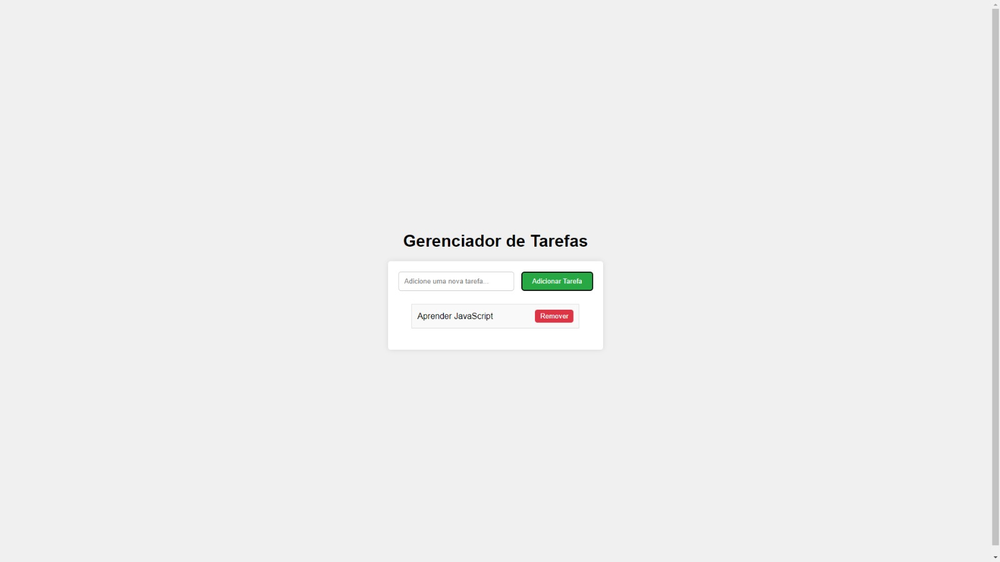

# Projeto To Do List
Gerenciador de Lista de Tarefas. Projeto onde o usuário adiciona, remove e visualiza suas tarefas.

<h1 align="center">
  To Do List
</h1>

  

Funcionalidades principais:

Adicionar tarefas: O usuário insere uma tarefa, que é adicionada ao array.

Remover tarefas: O usuário pode remover tarefas específicas da lista.

Listar tarefas: As tarefas são mostradas na tela a partir do array, sendo atualizadas sempre que algo mudar.

